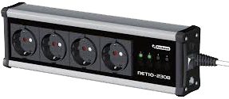

# ioBroker.netio

**Tests:**: 

## netio adapter for ioBroker

Koukaam NETIO adapter. created by FeLIX

This adapter allows remotely controlling the ports of an IP socket switch.
Using polling, the remote state is also synchronized when sockets are
operated directly on the device.

Supported devices: NETIO 230A/B/C/CS

## Changelog

### 0.1.2
* Vulnerability fix

### 0.1.1
* Vulnerability fix

### 0.1.0
* Optimizations, code cleanup

### 0.0.5
* ready for npm release

### 0.0.4
* improved state logic

### 0.0.3
* refinements

### 0.0.2
* polling support

### 0.0.1
* initial release

## License
MIT License

Copyright (c) 2019 FeLIX

Permission is hereby granted, free of charge, to any person obtaining a copy
of this software and associated documentation files (the "Software"), to deal
in the Software without restriction, including without limitation the rights
to use, copy, modify, merge, publish, distribute, sublicense, and/or sell
copies of the Software, and to permit persons to whom the Software is
furnished to do so, subject to the following conditions:

The above copyright notice and this permission notice shall be included in all
copies or substantial portions of the Software.

THE SOFTWARE IS PROVIDED "AS IS", WITHOUT WARRANTY OF ANY KIND, EXPRESS OR
IMPLIED, INCLUDING BUT NOT LIMITED TO THE WARRANTIES OF MERCHANTABILITY,
FITNESS FOR A PARTICULAR PURPOSE AND NONINFRINGEMENT. IN NO EVENT SHALL THE
AUTHORS OR COPYRIGHT HOLDERS BE LIABLE FOR ANY CLAIM, DAMAGES OR OTHER
LIABILITY, WHETHER IN AN ACTION OF CONTRACT, TORT OR OTHERWISE, ARISING FROM,
OUT OF OR IN CONNECTION WITH THE SOFTWARE OR THE USE OR OTHER DEALINGS IN THE
SOFTWARE.